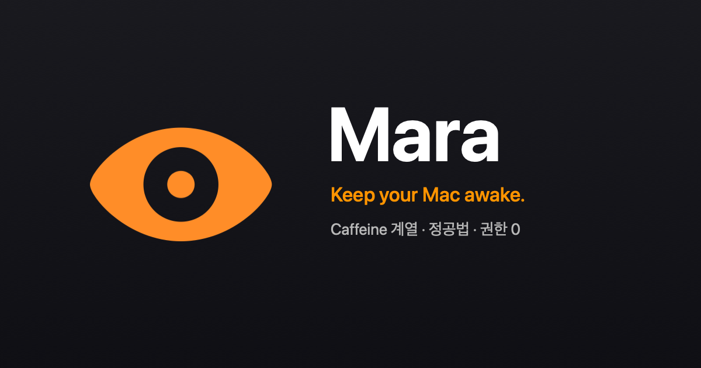

<p align="center">
  <a href="https://ai-scream.ai/mara/">
    
  </a>
</p>

<p align="center">
  <b>The eye that keeps your Mac awake.</b><br>
  A macOS menu-bar app that keeps your Mac from sleeping — Caffeine-style, built the honest way.
</p>

<p align="center">
  <a href="https://ai-scream.ai/mara/">Website</a> ·
  <a href="https://github.com/ai-screams/mara/releases/latest">Download</a> ·
  <a href="RELEASING.md">Release process</a>
</p>

<p align="center">
  <a href="https://github.com/ai-screams/mara/actions/workflows/ci.yml"></a>
  <a href="https://github.com/ai-screams/mara/actions/workflows/secret-scan.yml"></a>
  <a href="https://github.com/ai-screams/mara/actions/workflows/ci.yml"></a>
  <a href="https://github.com/ai-screams/mara/releases/latest"></a>
  <a href="LICENSE"></a>
</p>

<p align="center">
  <a href="https://www.apple.com/macos/"></a>
  <a href="https://swift.org"></a>
  <a href="#install"></a>
  <a href="RELEASING.md"></a>
  <a href="https://sparkle-project.org"></a>
  <a href="https://github.com/sponsors/ai-screams"></a>
  <a href="https://ko-fi.com/pignuante"></a>
</p>

> On the name: in folklore, a *mara* is a spirit that sits on a sleeper's chest and disturbs their rest — the root of *nightmare* (night + mare). Mara keeps watch so your Mac stays restless.

No permission bypasses, no undocumented tricks. Mara uses only **official IOKit power assertions**, **IOKit power-source state**, **SMAppService**, and the **system routing table** — zero Location, Accessibility, or Screen Recording prompts.

## Features

- **One-click keep-awake** from the menu bar — the eye opens and turns orange while your Mac is kept awake
- **Indefinite or timed**: presets (`15m` / `1h` / `2h` / `5h`), any custom duration, or until a time of day — recent custom durations are one click away
- **Live countdown** next to the icon: 5-minute ticks, switching to 1-minute steps for the last five minutes
- **System-only or display too** — choose whether the screen is allowed to sleep
- **Low-battery auto-off**: on battery, keep-awake won't start — and a running session ends safely — when you're at or below your threshold
- **Automatic triggers** — keep awake while:
  - AC power is connected
  - an external display is connected
  - a watched app is running — pick it from the currently running apps, or enter a bundle ID manually
  - you're on a specific network
- **Trigger diagnostics** in Settings show live status for each enabled trigger
- **Optional notifications** on automatic session start and end — trigger-started sessions, and stops from a timer, low battery, or a cleared trigger; manual actions stay silent (off by default)
- **Night Watch settings** — an always-dark, brand-styled settings window whose eye mirrors the live session state
- **Shortcuts support** — start (optionally with a duration), stop, and check status from Apple's Shortcuts app
- **Automatic updates** via [Sparkle](https://sparkle-project.org): every release ships an EdDSA-signed update feed
- **Launch at login** via Apple's `SMAppService`

The network trigger uses no location permission. It normalizes and matches the default gateway's MAC address, so there is no CoreLocation prompt.

## Install

1. Download `Mara-<version>.dmg` from the [latest release](https://github.com/ai-screams/mara/releases/latest).
2. Open the DMG and drag **Mara** onto the Applications link in the installer window.
3. Launch Mara — a closed-eye icon appears in the menu bar. Click it and choose `Keep Awake`.

Requirements:

- macOS 14 or later
- Apple Silicon and Intel Macs
- Developer ID–signed and Apple-notarized DMG (opens Gatekeeper-clean, no warning)
- No Location, Accessibility, or Screen Recording permissions

Updates are delivered in-app: Mara checks the signed release feed and offers new versions automatically (or use `Check for Updates…` in the menu).

## Usage

On first launch, a short guide popover points out the menu-bar eye and offers to enable Launch at Login.

Click the menu-bar eye for:

- `Keep Awake` / `Turn Off`
- `Keep awake for…`: `15 minutes`, `1 hour`, `2 hours`, `5 hours` — recently used custom durations reappear under `Recent` (with a `Clear Recent` action), and `Custom…` opens a dialog for any duration or a specific time of day
- `Keep display awake`
- `Launch at Login`
- `Check for Updates…`
- `Settings…`
- `Quit Mara`

When a session is started by an automatic trigger, the menu shows an `Auto-activated (trigger)` status. If you turn it off manually, it will not restart while the trigger is still true; it re-arms only after every trigger has cleared. Manual control always takes precedence over triggers.

## Architecture

| Area | Responsibility |
|---|---|
| `App/` | AppKit `NSStatusItem` menu-bar entry, SwiftUI settings window, preferences persistence, launch-at-login, wiring of the OS adapters |
| `MaraCore/` | Swift Package. OS-free session/trigger/scheduling core behind protocols |
| `MaraCore/Sources/MaraCore/SleepEngine.swift` | Transactional reconcile of display/system IOKit assertions — acquires all needed tokens before committing state, rolls back only tokens created in that call on partial failure, and retains failed-release tokens so a later `releaseAll()` retries |
| `MaraCore/Sources/MaraCore/SessionManager.swift` | Single session state, timer, scope changes, low-battery veto — state transitions are atomic (flip only after assertions are confirmed applied/released) and surface failures via a published `lastFailure` |
| `MaraCore/Sources/MaraCore/Triggers/` | Charging, external-display, app-running, and network triggers with suppression/re-arm logic |
| `MaraCore/Tests/` | Core unit tests, routing-table parser tests, and real-IOKit assertion integration tests |
| `scripts/release.sh` | XcodeGen, archive, Developer ID export, notarization, staple, branded DMG build and verification |
| `scripts/install-xcodegen.sh` | Checksum-pinned XcodeGen install, shared by CI and the release job |
| `scripts/ed25519_pub.py` | Stdlib-only Ed25519 public-key derivation for the release key-match gate (no third-party deps) |
| `scripts/dmg/` | Night Watch DMG installer background (generator + committed 1x/2x assets) |
| `docs/` | Public landing page served via GitHub Pages |

Global-hotkey (Carbon) code is kept in `App/HotkeyManager.swift` but is currently disabled. Closed-lid (clamshell) keep-awake needs a privileged daemon with a lease-based recovery model and is out of scope for now.

## Development

Tooling:

- Xcode 15 or later
- Swift 5.9 or later
- XcodeGen

```bash
brew install xcodegen
```

Common commands:

```bash
# Core unit tests
make test

# Generate project.yml -> Mara.xcodeproj
make generate

# Verify an unsigned Debug build
make build
```

`Mara.xcodeproj` is generated and not committed. When exercising runtime and permission flows, use a stable Apple Development–signed build rather than an ad-hoc signature (ad-hoc rebuilds change the cdhash and break TCC-granted permissions).

## Releasing

Distribution is a Developer ID–signed, Apple-notarized, drag-to-Applications DMG with a branded installer window, plus an EdDSA-signed Sparkle appcast for automatic updates.

```bash
xcrun notarytool store-credentials mara-notary \
  --apple-id "<apple-id>" \
  --team-id 7K6MK3KP9K \
  --password "<app-specific-password>"

DEVELOPMENT_TEAM=7K6MK3KP9K NOTARY_PROFILE=mara-notary make release
```

`scripts/release.sh` runs:

- `scripts/generate-project.sh` (`xcodegen generate` + committed SwiftPM revision lock restore)
- Release archive
- Developer ID export
- Deep signature / Hardened Runtime verification (including embedded Sparkle)
- App notarization and staple
- Branded DMG creation (Night Watch installer window)
- DMG signing, notarization, and staple
- `spctl` and `stapler` verification

Pushing a tag runs the same release path on GitHub Actions:

```bash
git tag v1.0.0
git push origin v1.0.0
```

The release workflow runs in a protected `release` environment (requires reviewer approval before the signing/notarization secrets are exposed), builds and notarizes the DMG, signs the update feed after verifying the signing key matches the key embedded in the app, and attaches the DMG, its `.sha256` checksum, and `appcast.xml` to a GitHub Release. Installed apps pick updates up from `releases/latest/download/appcast.xml`. Prerelease tags (containing `-`, e.g. `v1.0.0-rc.1`) are published as pre-releases and excluded from "latest". Full steps and required secrets are in [RELEASING.md](RELEASING.md).

## Quality gates

- CI: `swift test`, coverage gate (≥80% overall plus per-file critical floors — SleepEngine 95%, SessionManager 90%, PowerAssertion 90%, BatteryMonitoring 75%, RoutingTableNetworkProvider 45%), revision-locked SwiftPM resolution, and an unsigned Debug build
- Concurrency: complete strict-concurrency checking with warnings treated as errors for the full app build
- Secret Scan: TruffleHog verified/unknown results
- GitHub Actions supply-chain hardening:
  - all third-party actions pinned to commit SHAs, kept current by Dependabot
  - **XcodeGen** installed from a checksum-pinned release (`scripts/install-xcodegen.sh`) — the same script runs in CI and in the release job, so every PR exercises the exact release install path
  - the **update-signing-key check derives the Ed25519 public key with the Python standard library only** (`scripts/ed25519_pub.py`, RFC 8032, self-tested against the spec's vectors on every run) — no third-party package is downloaded or executed in the job that holds the Sparkle signing key
  - protected `v*` tags with an approved-commit checkout guard
- Release verification: `spctl -t open`, `xcrun stapler validate`, Sparkle key-match gate

## Support

Mara is built and maintained by one person — no ads, no telemetry. If it earns a place on your Mac, you can help fund its development:

<p>
  <a href="https://github.com/sponsors/ai-screams">
    
  </a>
  &nbsp;
  <a href="https://ko-fi.com/pignuante">
    
  </a>
</p>

## License

Proprietary and confidential. See [LICENSE](LICENSE) for details.
